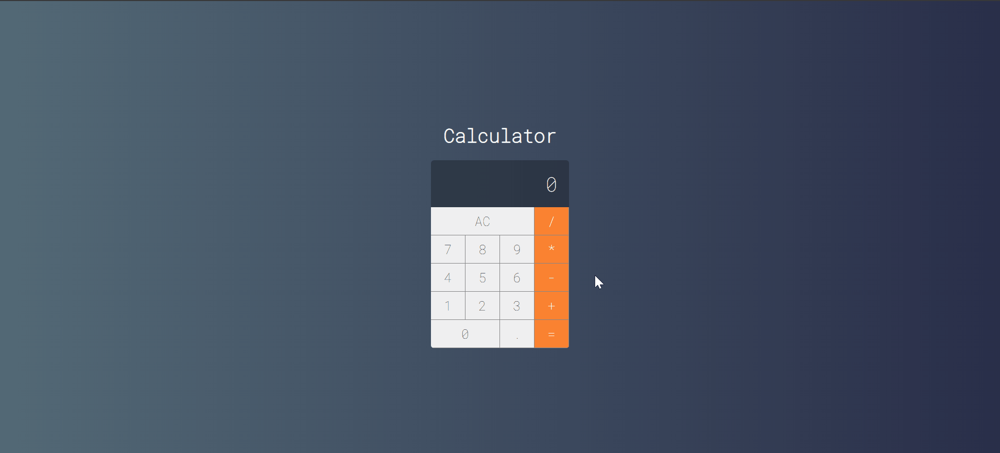

<h1 align="center">
  Projeto Calculadora em Vue
</h1>
<br>
<p align="center" color="red">
  Este projeto é uma calculadora simples feita com o framework 'Vue'
</p>

## Funcionalidades da calculadora - simples
<p>
  Contas de: mais="+", menos="-", vezes="*" e divisao="/".
</p>
<div align="center">
  
</div>


# Calculator Project Guide

## Project setup
```
yarn install
```

### Compiles and hot-reloads for development
```
yarn serve
```

### Compiles and minifies for production
```
yarn build
```

### Lints and fixes files
```
yarn lint
```

### Customize configuration
See [Configuration Reference](https://cli.vuejs.org/config/).
